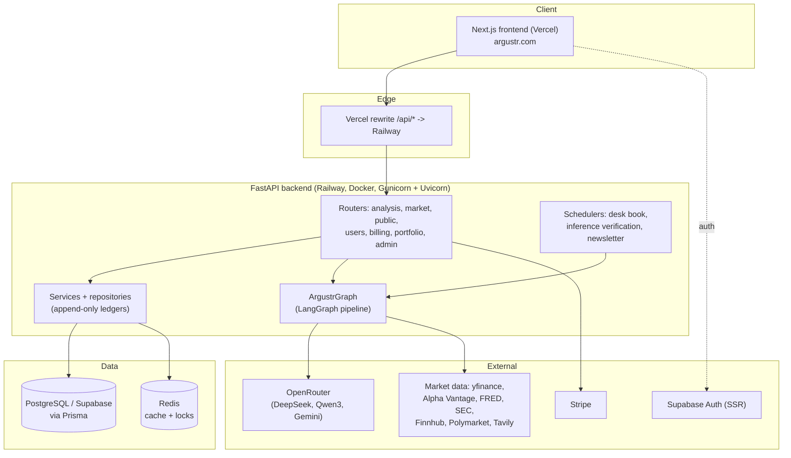
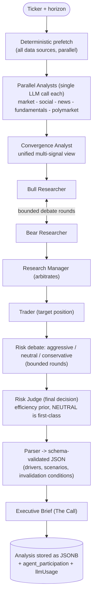
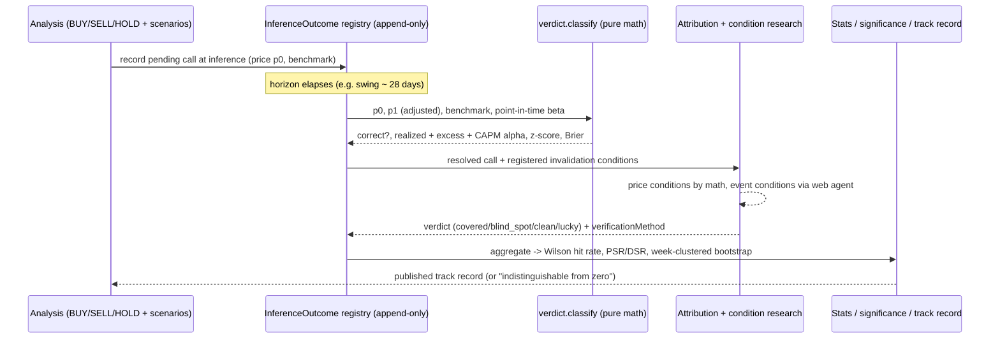

# Argustr: a multi-agent analysis desk that grades its own calls

Product: https://argustr.com

A technical case study written by reading the actual source: a Python FastAPI backend, a LangGraph multi-agent pipeline, a Next.js frontend, and a PostgreSQL (Supabase) data model managed through Prisma.

## The problem and what it does

Most AI market tools hand you a black-box buy or sell signal. A serious investor cannot act on a number with no reasoning attached, and cannot audit it afterwards when it turns out wrong. Worse, almost none of these tools ever check whether their own past calls were right.

Argustr does two things. First, it runs a team of specialised AI agents over a listed asset (stock, index, crypto, FX, ETF), the way an analysis desk would: collect data, run a contradictory bull-versus-bear debate, then reach an argued position (LONG, SHORT or NEUTRAL) with scenarios and price targets. Second, and this is the differentiator, every verifiable call is written to an append-only registry and later graded against the real market price, with no AI in the loop. The grading is pure arithmetic, settled verdicts are never rewritten, and the resulting track record is published with honest confidence intervals (the site shows "indistinguishable from zero" rather than a misleading number while the sample is small).

A fixed "desk book" of 25 US megacaps is analysed automatically (5 tickers per trading day) so enough comparable calls accumulate (around 100 a month) for the statistics to mean something. On alternating days the asset identity is masked from the agents (Apple becomes ASSET) to A/B test whether the system is reasoning from data or reciting what it already knows about famous companies.

## Architecture in real detail

The repository is a monorepo: `frontend/` (Next.js, deployed on Vercel), `backend/` (FastAPI plus the agent engine, deployed on Railway), `supabase/` and `backend/prisma/` (PostgreSQL schema and migrations). The frontend never calls the backend origin directly; it calls `/api/*` which Vercel rewrites to the Railway service. The API contract is typed end to end: the backend exports `openapi.json`, and the frontend regenerates TypeScript types from it (`npm run gen:api` via `openapi-typescript`).

### Component map

- `backend/api/` is the FastAPI layer, kept deliberately thin. `api/main.py` only wires middleware, exception handlers, lifespan and routers. The interesting work lives in `api/routers/` (analysis, public, market, users, billing, portfolio, admin), `api/services/` (around 40 service modules), `api/repositories/` (Prisma data access, append-only ledgers), and `api/scheduler/` (cron-driven desk book, inference verification, newsletters, portfolio cycles).
- `backend/argustr/` is the core engine: `agents/` (analysts, researchers, managers, trader, risk debaters), `graph/` (the LangGraph pipeline `ArgustrGraph` and its setup, parser and frontend mapper), `dataflows/` (market data sources and caches), `verification/` (verdict math, statistics, desk book) and `attribution/` (error attribution). The `verification/` and `attribution/` cores are explicitly pure: in-memory functions only, no network, no database, no LLM.

### The agent pipeline and how it is orchestrated

The pipeline is a compiled LangGraph `StateGraph` built in `argustr/graph/setup.py`. A key engineering choice is documented at the top of that file: a hybrid architecture. The analysts are deterministic (no tool-calling loops), the debate and decision layers are agentic (the reasoning is the value). This deliberately cut LLM calls from roughly 25 to 35 per analysis down to around 16.

The flow:

1. Parallel Analysts node. Rather than letting each analyst LLM decide which tools to call, `argustr/dataflows/prefetch.py` fetches all relevant data for all analysts concurrently (a single `asyncio.gather`), adapting to the asset type (no fundamentals for FX, for example). The pre-fetched blocks are injected into state, then each analyst makes exactly one LLM call to write its report. Five analysts exist: market/technical, social/sentiment, news, fundamentals, polymarket (prediction markets). If `state["_mask"]` is set, the identity is redacted from what the analysts see (the data was fetched with the real ticker, so the mask is purely a reasoning control).
2. Convergence Analyst. Reads all five analyst reports and synthesises a unified multi-signal view (alignment, divergences, horizon-weighted) to improve the downstream debate.
3. Bull versus Bear debate. Two researcher agents argue the long and short thesis; a conditional edge (`conditional_logic.should_continue_debate`) loops them for a bounded number of rounds, then routes to the Research Manager who arbitrates.
4. Trader. Proposes a target position from the manager's verdict.
5. Risk debate. Three risk debaters (aggressive, neutral, conservative) argue, looping via `should_continue_risk_analysis`, then the Risk Judge issues the final decision. The decision prompts carry an explicit efficiency prior: the current price already reflects public information, so a directional call requires evidence not yet in the price, and NEUTRAL is a first-class answer rather than a failure.

After the graph completes (outside the graph), a Parser agent converts the free-text reports into a strict, schema-validated JSON object, and an Executive Brief agent writes a short institutional one-paragraph synthesis ("The Call") from the already-structured result.

How the reasoning is made auditable, in code:

- Every agentic node is wrapped by `_wrap_with_tracking`, which records per-agent participation into `agent_participation`: status (success, error, skipped), the exact model used, output size in characters, and elapsed seconds. This is persisted with the analysis, so you can see which agent ran, on which model, and whether it failed. The same wrapper contains careful fallback logic so that an individual agent exception never deadlocks a conditional edge (it nudges debate counters so routing always moves forward).
- Token usage is captured for real unit economics. The graph runs inside a `get_usage_metadata_callback()` context so every LLM call inside the graph is metered; the result is converted to a USD cost estimate (`argustr/llm_cost.py`) and stored on the analysis as `llmUsage`. An empty capture is recorded as `{"captured": False}` so a metering regression is visible instead of silent (the comments note that 0 of 27 analyses had usage data on one date before this was fixed).
- The structured output is contract-driven Pydantic (`argustr/graph/parser_models.py`): `Driver`, `Agent`, `Scenario`, `KeyLevels`, `InvalidationCondition` and more, each with tolerant `model_validator` coercion to absorb LLM variations (a string where an object was expected, "factor" instead of "name", out-of-range weights clamped). The invalidation conditions registered here are what the later attribution step checks against.

### The verification core (the differentiator)

`argustr/verification/verdict.py` is the heart. Given the price at inference `p0` and at the due date `p1` (split- and dividend-adjusted), `classify()` returns a frozen `Verdict`: whether the BUY/SELL/HOLD call was correct, the realized return, a signed score (return in the claimed direction; HOLD is a no-position zero, not a fabricated loss), the error magnitude, the excess return versus a benchmark, the point-in-time beta, and the CAPM excess return (alpha, so a high-beta name that merely rode a rally is not credited). A `standardized_score` expresses excess in units of the asset's own volatility, so a crypto call and an FX call are comparable rather than the crypto implicitly weighting around 8x.

The honesty mechanism is `VERDICT_METHOD_VERSION` (currently 5). The registry is append-only: a settled verdict is never mutated. When the grading method changes, the version is bumped and the whole history is re-resolved into new rows; the maximum version per analysis is authoritative. The module docstrings record the full lineage (v2 adjusted prices and beta-adjusted alpha; v3 fixed HOLD scoring and made the HOLD tolerance band scale with the asset's own volatility; v4 added the standardized z-score; v5 excludes calls benchmarked against themselves, whose alpha is structurally zero and would bias the t-statistic).

`significance.py` answers skill versus luck without ever simulating the future: Sharpe, Probabilistic Sharpe Ratio and Deflated Sharpe Ratio (Bailey and Lopez de Prado, the DSR corrects for multiple testing), plus bootstrap confidence bands including a week-clustered bootstrap because overlapping verification windows are not independent. `stats.py` reports hit rate with a Wilson interval (never a naked rate), and `edge.py` only calls a segment actionable when its lower Wilson bound beats chance.

`attribution/attribution.py` closes the loop on errors. For each resolved call it checks the invalidation conditions the analysis itself registered: price conditions are graded by exact math against the `PriceBar` store, event conditions are researched on the open web by an autonomous agent (`api/services/condition_research_agent.py`, a bounded Tavily search-plan-judge loop). The structural verdict is conservative (covered, blind_spot, clean, lucky, or undetermined) and carries a `verificationMethod` flag that keeps a hard price-math proof apart from a soft web-judged guess. Blind spots feed back into future analyses.

### The data model (from the Prisma schema)

The schema (`backend/prisma/schema.prisma`, around 25 models) makes the auditable design explicit. Highlights:

- `Analysis` stores the full result as a JSONB `data` blob, keyed by ticker and horizon, with a `source` of `scheduled` (desk book) or `user_requested`.
- `AnalysisAccess` is a per-user isolation join (user to analysis) so a user only sees requested analyses they own.
- `InferenceOutcome` is the append-only verdict registry: decision, confidence, price and benchmark at inference and due dates, the benchmark used (SPY, BTC or CASH), correctness, realized and excess and CAPM returns, beta, sigma, standardized score, scenario hit, Brier, plus `methodVersion`. The unique constraint `(analysisId, methodVersion)` enforces one authoritative row per method.
- `InferenceErrorAttribution` mirrors that append-only shape for the why: verdict, cause category, the conditions checked with their evidence, and the `verificationMethod` (deterministic vs llm_assisted).
- Operational and product models: `WatchedTicker`, `SchedulerLog`, `Subscription` (Stripe plan and quota, source of truth), `ProcessedStripeEvent` (webhook idempotence so a replayed event cannot reset a quota), `Job` (persisted analysis jobs surviving restarts), `PriceBar`, and event-sourced `Portfolio`, `Position`, `PortfolioSnapshot`, `TradeEvent`, `Decision` for the admin portfolio cockpit.

### LLM usage

The pipeline is provider-agnostic through OpenRouter, which gives a single API key access to many model families. `argustr/llm_factory.py` is a multi-provider factory (OpenAI, DeepSeek, Mistral, Anthropic, Grok, Google, Ollama, OpenRouter), and `default_config.py` assigns a specific model to each agent role, tuned by measured cost and latency:

- Analysts and convergence: a fast non-reasoning MoE (Qwen3 235B A22B), chosen after a documented failure where Gemini Flash Lite degenerated into emitting tens of thousands of whitespace tokens.
- Fundamentals: DeepSeek V3.2 for stronger financial reasoning.
- Trader: a thinking MoE (Qwen3 235B thinking), chosen over DeepSeek R1 after measuring R1 consuming around 47% of the LLM critical path on that one step.
- Risk Judge: DeepSeek R1 for auditable multi-step risk reasoning.
- Risk debaters and parser: Gemini Flash Lite (1M context, strong JSON instruction following).

The factory bounds every call (default 60s timeout, 3 retries, 32k max completion tokens) so a hung provider cannot pin a Gunicorn worker toward its 600s timeout. The OpenRouter integration pins `sort=throughput` (the same model id is served by many providers with swings from 130s to 340s) and sends `require_parameters=true` plus `max_tokens` via `extra_body`, after a documented incident where the newer `max_completion_tokens` field silently filtered out every routable provider and 404'd the whole pipeline.

### Deployment shape

The backend ships as a Docker image (`backend/Dockerfile`) run under Gunicorn with Uvicorn workers. `docker-compose.yml` is the production-shaped local run (port 8080, `/health` healthcheck, env from `.env` plus optional `.env.local`, a persisted data-cache volume). `docker-compose.dev.yml` overrides it for development: source mounted as volumes, `prisma db push`, and a single Uvicorn worker with `--reload`. Railway is the production backend host (`railway.toml` is the source of truth, with watch patterns so only `backend/**` changes redeploy), Vercel hosts the frontend, Supabase hosts PostgreSQL, and Redis provides caching and locks. Migrations are additive, versioned, and applied with `prisma migrate deploy` before each deploy.

## Diagrams

### System architecture

### Multi-agent reasoning pipeline

### From a call to a graded, attributed verdict

## Tech stack (concrete, per the code and dependencies)

- Frontend: Next.js (App Router) with React 19 and TypeScript, Tailwind CSS, Radix UI / shadcn components, Recharts, GSAP and three.js, Supabase SSR auth (`@supabase/ssr`), Vercel AI SDK (`ai`, `@ai-sdk/react`) for the chat-with-an-analysis feature, Sentry, Vitest and Playwright. Types are generated from the backend OpenAPI schema.
- Backend API: FastAPI on Python 3.12, Gunicorn plus Uvicorn workers, SlowAPI rate limiting (keyed on a signature-verified user id, falling back to IP), PyJWT for Supabase JWT verification, Sentry, Resend for email, WeasyPrint for PDF reports, Stripe.
- Agents and pipeline: LangGraph plus LangChain, with `langchain-openai`, `langchain-anthropic` and `langchain-google-genai`. LLM access is routed through OpenRouter; the models actually configured per agent are DeepSeek V3.2 and R1, Qwen3 235B (non-thinking and thinking variants) and Gemini 2.5 Flash Lite.
- Market data: yfinance / Yahoo Finance, Alpha Vantage (news and fundamentals), Google News and Trends (pytrends), FRED (macro), SEC EDGAR, Finnhub (real-time, relayed to the browser over SSE), Polymarket (prediction markets), Fear and Greed, Tavily (event-condition web research). ChromaDB backs the agent memory.
- Data layer: PostgreSQL on Supabase accessed through Prisma (the async Python client), Redis for cache and locks.
- Deployment: Vercel (frontend), Railway (backend), Docker, Supabase (database and auth), Stripe (billing).

## Engineering decisions and trade-offs

- Deterministic prefetch for analysts, agentic reasoning only where it pays. Letting each analyst LLM tool-call freely is slow, expensive and non-reproducible. By pre-fetching all data deterministically and reserving agentic loops for the debate and decision layers, the team roughly halved LLM calls and made the data side reproducible, while keeping genuine multi-agent reasoning where the argument itself is the product. The business rationale is unit economics and latency on a critical path that brushes the worker timeout.
- Pure, IO-free verification and attribution cores. The grading math has no network, no database and no LLM, and never re-runs a model to judge a past call, which makes look-ahead contamination structurally impossible and the entire history backfillable from two prices. This is what lets Argustr publish a track record it can defend.
- Append-only registries with method versioning. Settled verdicts are immutable; methodology changes write new rows under a higher version rather than rewriting history. This is the credibility backbone: a track record you can quietly re-tune is worthless, so the design makes silent revision impossible by construction.
- Honest statistics over flattering numbers. Wilson intervals instead of naked hit rates, Deflated Sharpe to punish multiple testing, week-clustered bootstrap because verification windows overlap, and an explicit "indistinguishable from zero" state at small samples. In a field full of cherry-picked backtests, refusing to overclaim is the differentiator.
- The desk book and identity masking. A fixed 25-name universe on a fixed cadence removes selection bias and manufactures statistical power that user-driven calls alone could never reach, and the alternating-day identity mask turns "is this reasoning or memorisation?" into a measurable experiment rather than a marketing claim.
- Provider-agnostic, per-agent model routing through OpenRouter, with measured choices. Each role runs the cheapest model that passed an A/B on quality, every call is bounded against hung providers, and known model failure modes (whitespace degeneration, the `max_completion_tokens` routing trap) are encoded directly in the factory. Swapping a model is a config change, not a rewrite, which keeps the cost structure tunable as the model market moves.
- End-to-end typed contract and a thin API. The backend exports OpenAPI, the frontend generates its types, and `api/main.py` stays a wiring file with logic pushed into services and repositories. This keeps the two halves of the monorepo in lockstep and the backend testable, with a hermetic offline unit-test suite for the pure cores.

(Note: some directory and class names in older docstrings reference the project's earlier "tradingagents" lineage; the live code and packages use the `argustr` namespace.)
