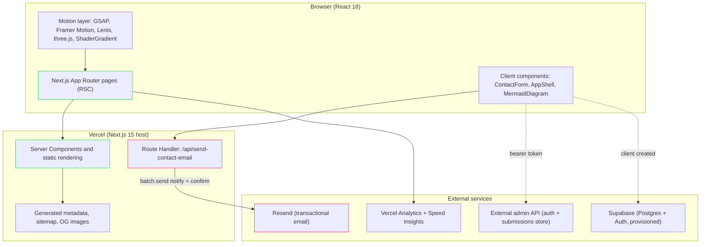
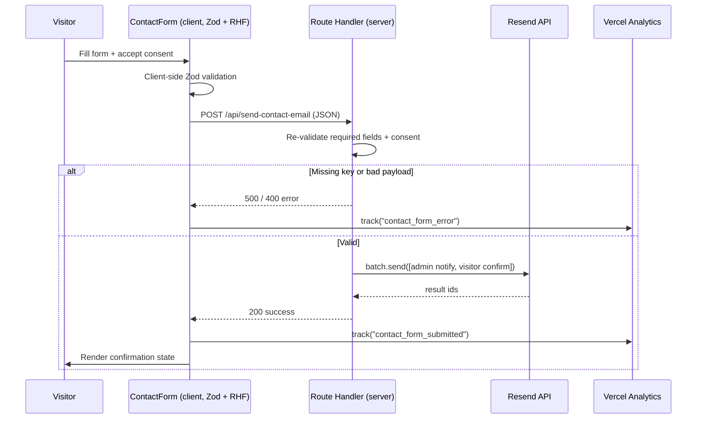
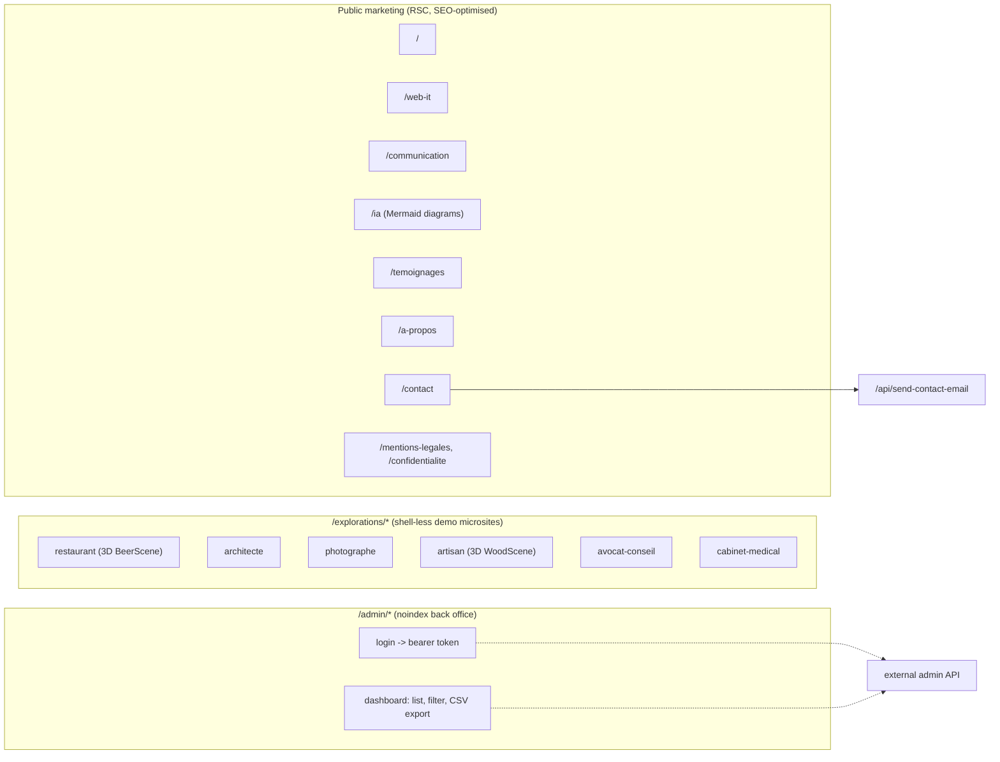

# Aurelona Digital: building and running my own AI consulting platform

**Type.** Freelance AI consulting and delivery practice (no public product to sell, the practice itself is the product).
**Public site.** aurelona.tech
**Role.** Founder, solo engineer and consultant (scoping, design, build, deploy, training).
**Stack (real, from the code).** Next.js 15 (App Router) on React 18, TypeScript, Tailwind CSS 3 with shadcn/ui (Radix), Supabase JS client, Resend for transactional email, GSAP + Framer Motion + Lenis + three.js / react-three-fiber + ShaderGradient for motion, Mermaid for live diagrams, Vercel Analytics and Speed Insights, built and deployed on Vercel with Bun as the package manager.

---

## 1. What Aurelona is

Aurelona Digital is my freelance practice serving small and mid-sized businesses, independents and associations across Belgium, Luxembourg and the Paris region. The offer spans four areas: web and IT, communication, identity, and AI (training plus integration). The repository in this case study is the practice's own public site and lightweight back office, not a client deliverable. It is the shop window and the lead pipeline for everything else I deliver.

I work the full arc on each engagement:

- **Scope.** An audit phase maps a client's processes and surfaces a handful of high-value AI use cases, with a written report and a budget estimate for integration.
- **Build.** I deliver one use case in production: selecting and configuring the AI tooling, connecting it to the systems the client already runs, then handing it over.
- **Deploy and train.** I ship to a real host, then train the client's team so the thing keeps living after I leave, with a window of post-deployment support.
- **Industrialise.** For larger clients, a multi-month program runs several use cases under a monthly steering cadence.

The site itself is built the same way I build for clients, so it doubles as a reference implementation: a fast App Router site, a typed contact pipeline, a minimal admin back office, and heavy use of motion and 3D to make a one-person practice feel like a studio.

## 2. The Aurelona application, in real detail

### Next.js App Router structure

The app lives under `src/app` and uses the App Router. Pages are React Server Components by default; interactivity is pushed into `'use client'` leaves co-located in per-route `_components` folders. The root `layout.tsx` sets the French locale, the full `Metadata` object (title template, OpenGraph, Twitter card, robots), loads the Fraunces serif via `next/font/google`, and wraps everything in three layers:

- `StructuredData` injects schema.org JSON-LD (Organization, WebSite, founder) for SEO.
- `Providers` (client) sets up TanStack Query, the Radix `TooltipProvider`, two toaster systems (shadcn + Sonner), and initialises AOS scroll animations once.
- `AppShell` (client) is the visual chrome: a boot sequence, a fixed brand logo that fades on scroll, a custom cursor, a fixed ShaderGradient background, the header and footer, and a Lenis smooth-scroll provider around the page content.

`AppShell` carves out one exception: routes under `/explorations/*` render bare (no shell), because each is a standalone, fully art-directed demo microsite (restaurant, architect, photographer, artisan, lawyer, medical practice) with its own 3D scenes (`BeerScene`, `WoodScene`, `FloatingPhotos`), custom cursors and per-page CSS. These are sales assets: living proof of what I can build, segmented by client vertical.

Public marketing routes are static-leaning RSC pages: `/` (home), `/web-it`, `/communication`, `/ia`, `/temoignages`, `/a-propos`, `/contact`, plus legal pages. `sitemap.ts` and `opengraph-image.tsx` / `twitter-image.tsx` are generated through Next's metadata file conventions. The heavy three.js demo (`WoodScene`) is pulled in with `next/dynamic` to keep it out of the initial bundle.

### The contact pipeline (the one real server feature)

The only first-party server endpoint in this repo is the App Router Route Handler at `src/app/api/send-contact-email/route.ts`. The flow is:

1. The `/contact` page renders a client `ContactForm` built with React Hook Form and a Zod schema (name, email, optional company and phone, message, and a required consent checkbox). Validation runs client-side; on submit it POSTs JSON to `/api/send-contact-email`.
2. The Route Handler validates the payload again server-side (required fields plus explicit consent), then uses the Resend SDK's `batch.send` to fire two emails in one call: a branded notification to the practice inbox (with `replyTo` set to the visitor so a reply lands straight in their inbox) and a branded confirmation back to the visitor. Both emails are hand-built responsive HTML with the Aurelona gradient identity, assembled from small `header` / `row` / `footer` builder functions.
3. The Resend API key is read from `process.env` and the handler returns 500 early if it is missing, so the secret never ships to the client.

Submissions are tracked as analytics events (`contact_form_submitted` / `contact_form_error`) via `@vercel/analytics`, which feeds conversion insight without a database write.

### The admin back office

There is a minimal admin area (`/admin/login`, `/admin/dashboard`) for reviewing contact submissions: list, filter by status (pending or processed), mark processed, delete, and export to CSV. Architecturally this is a thin client UI. It authenticates against an external API base (`NEXT_PUBLIC_API_BASE_URL`, falling back to same-origin `/api/admin/*`), stores a returned bearer token in `localStorage`, and sends it as an `Authorization` header on each request. The submissions store and admin auth it talks to are a separate backend, not part of this Next.js repo, which keeps the public site stateless and the persistence layer decoupled.

### Supabase: wired, not yet load-bearing

The repo includes a Supabase integration (`src/integrations/supabase/client.ts`) that instantiates a typed `createClient<Database>` from `NEXT_PUBLIC_SUPABASE_URL` and the anon key, with session persistence and auto-refresh configured for browser auth. A `supabase/config.toml` pins the project. However, the generated `Database` type currently declares no tables, views or functions, and the client is not imported anywhere else in `src`. In its current state Supabase is provisioned and ready (auth plus Postgres available) but the live data path for contact submissions runs through Resend (email) and the external admin API, not through Supabase. This is an honest snapshot: the backend is scaffolded for the next iteration rather than already central.

### The AI angle in the product itself

The `/ia` page is where the consulting offer is presented, and it is also where I dogfood AI-explainability UX. The page renders process and architecture diagrams client-side with Mermaid (`MermaidDiagram.tsx`): Mermaid is initialised with a custom transparent "base" theme and a large block of scoped CSS that restyles nodes into glowing outlined shapes, animates edges with a dashed flow animation, and recolours node classes (AI, sources, governance, usage) to the brand palette. The diagram source is passed in as a string and rendered to SVG in a `useEffect`, with a spinner fallback. The result is that abstract AI integration concepts (audit to integration to training cycles) are shown as animated, on-brand flow diagrams rather than static images.

The AI work I sell (conversational agents, automation, ChatGPT-class tooling integrated into client processes) is delivered inside client environments, so it does not live in this repo. What lives here is the presentation and scoping surface for that work.

## 3. Diagrams

### System architecture

### Contact request and email flow

### Route and rendering map

## 4. Tech stack (concrete)

| Layer | Choice |
| --- | --- |
| Framework | Next.js 15 (App Router), React 18, TypeScript 5.8 |
| Styling / UI | Tailwind CSS 3.4, shadcn/ui on Radix primitives, Tailwind Typography, `tailwindcss-animate`, custom brand HSL tokens |
| Motion / 3D | GSAP + `@gsap/react`, Framer Motion, Lenis smooth scroll, three.js + react-three-fiber + drei, ShaderGradient, AOS |
| Forms / validation | React Hook Form + `@hookform/resolvers` + Zod |
| Data fetching | TanStack Query (provider set up) |
| Diagrams | Mermaid (client-rendered, custom themed) |
| Email | Resend (`batch.send`, branded HTML) |
| Backend services | Supabase JS (Postgres + Auth, provisioned), external admin API for submissions |
| Analytics | Vercel Analytics + Speed Insights |
| Tooling | Bun (lockfile `bun.lockb`), ESLint 9, `eslint-config-next`, PostCSS, Autoprefixer |
| Deploy | Vercel (`vercel.json` sets framework to nextjs) |

A note on accuracy: the committed `README.md` and `Dockerfile` describe an earlier Vite + React Router + nginx static build. They are stale. The live project is a Next.js 15 App Router app deployed on Vercel; `package.json`, `next.config.ts`, `vercel.json` and the `src/app` tree are the source of truth.

## 5. How I deliver, and why it matters

**Server-first, secrets server-side.** The contact pipeline does its real work in a Route Handler. The Resend key is read from the environment and the handler refuses to run without it, so no credential reaches the browser. Validation runs on both sides: convenient errors on the client with Zod, an authoritative check on the server. For a lead-generation surface, that is the difference between a form that looks done and one that cannot be spammed past its consent gate.

**Decoupled persistence.** The public site stays stateless and fast. Anything stateful (admin auth, the submissions store) sits behind a separate API addressed through an env-configured base URL, and Supabase is provisioned alongside for the next iteration. I can swap or scale the backend without touching the marketing site, and the marketing site can be cached and shipped to the edge without a database in the hot path.

**Performance budget despite heavy motion.** This is a visually maximal site (full-screen shader background, custom cursor, smooth scroll, multiple 3D scenes). I keep it shippable by defaulting pages to Server Components, isolating client interactivity into small leaves, lazy-loading the expensive three.js scenes with `next/dynamic`, and measuring real user performance with Speed Insights. Motion is a sales tool here, but it is paid for with discipline.

**Built to be the reference.** The `/explorations` microsites and the Mermaid-driven `/ia` page exist because a consultant's credibility is their last demo. Building my own site to the standard I sell means the codebase is also the portfolio, and the scoping conversation can point at something real.

Why it matters for clients: the same loop runs on their projects. Scope the use case, build it server-first with secrets handled correctly, deploy on a host that gives previews and instant rollbacks, instrument it so we can see whether it works, then train the team. The site is the smallest honest demonstration of that method.

---

*Confidentiality note: this write-up describes only the architecture of the Aurelona application as found in source. No secrets, keys, environment values or connection strings are reproduced, and no client-confidential material from the private business-docs folder is included.*
