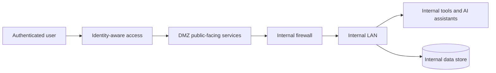
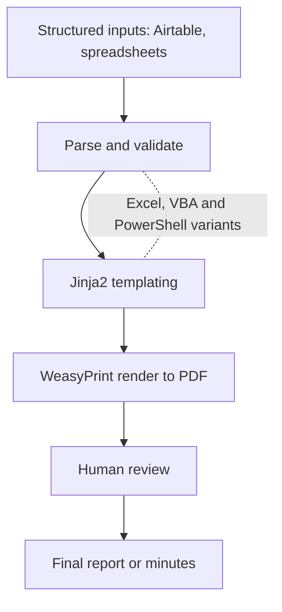

# Engineering at Innpact (professional work, kept private)

This is my day job. I am a Software Engineer at Innpact SA, a regulated impact-finance firm in Luxembourg. The systems, data and business logic here are Innpact's intellectual property and sit inside a regulated environment, so this page stays deliberately at the level of purpose, breadth and technology. No proprietary code, configuration, data model or business rule is shown. The goal is to give an honest picture of the range of engineering I do and the stacks I use, not how anything is implemented.

A neutral, clean-room version of the AI retrieval work I do here is open source as [rag-engine](https://github.com/DeharengOlivier/rag-engine).

## Project by project

Around fifteen internal projects, grouped by theme. Each entry is the purpose at a high level and the technology, nothing more.

### Internal platform and tooling

- **Internal intelligence platform.** A full internal platform that gives the teams one authenticated place to reach their tools and AI assistants, instead of scattered scripts. Full-stack TypeScript and React on the front end, a Python backend, containerized with Docker.

### Applied AI in production

- **Questionnaire scoring with RAG.** A retrieval-augmented system that automates the scoring of long, structured questionnaires that were previously reviewed by hand. FastAPI, LangChain, the OpenAI SDK, SQLAlchemy and Pydantic. The clean-room, non-proprietary version is my open-source [rag-engine](https://github.com/DeharengOlivier/rag-engine).
- **Company-wide AI assistant rollout (Claude).** Adoption strategy, security alignment, enablement and training, turning raw model capability into real daily use across technical and non-technical teams.
- **AI newsletter and internal training programme.** An automated internal AI newsletter and training stream to raise AI literacy across the firm. Python.
- **Meet and Learn (AI at Innpact).** Internal knowledge-sharing sessions and materials on applied AI. Documentation plus Python helpers.

### Reporting and document automation

- **Report generator.** Turns structured data, including an Airtable source, into formatted PDF reports that used to be assembled by hand. FastAPI, Jinja2 templating, WeasyPrint for HTML to PDF, and Pillow for image handling.
- **Board resolutions and minutes automation.** Automated extraction and validation of governance records from structured inputs. Excel and VBA macros, PowerShell scripting, and JavaScript.
- **Incident register automation.** Automates the upkeep of an operational incident register. Python.
- **Opportunity and tender search automation.** Automates searching and triaging opportunities and tenders. Python.
- **Decision-support workflow automation.** A structured internal decision-support workflow that removes manual steps from a recurring process. Python, kept deliberately generic.
- **Functional requirements harmonisation.** A tool to consolidate and harmonise functional requirements across teams. Python and Excel.

### Infrastructure and governance

- **Infrastructure audit and target network architecture.** An external, OSINT-style audit plus the design of a segmented internal network, with a public-facing DMZ separated from the internal LAN and identity-aware access, so internal and client-facing AI tools can be hosted securely.
- **Data governance activation.** Work to put data governance practices into day-to-day use.
- **AI usage policy.** Definition of an internal AI usage policy so the automation and AI work sits inside clear, auditable rules.

### Product engineering

- **Mira.** Engineering on Innpact's impact-measurement software.

## Stacks I use here

Python (FastAPI, pandas, Jinja2, WeasyPrint, LangChain), TypeScript and React, Docker, SQL, the Airtable API, Excel and VBA and PowerShell for office automation, and LLM providers (OpenAI, Anthropic).

## Illustrative architecture patterns (generic, not Innpact's actual topology)

These diagrams show the standard patterns I work with. They are intentionally generic and do not represent any real internal system or topology.

### Segmented network for hosting internal and client-facing tools

### Reporting and document automation flow

## Why this stays private

The value and the sensitivity both live in the specifics, the data, the rules and the exact implementation, which belong to Innpact and to a regulated context. Keeping this at the level of purpose, patterns and stacks lets me show the engineering without crossing that line. For the parts I can show in full, see my open-source [projects](https://github.com/DeharengOlivier).
