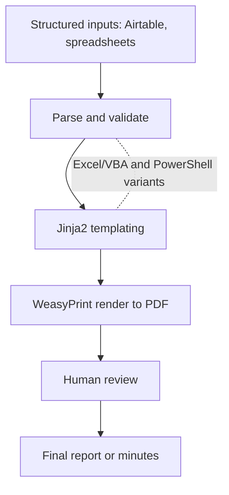

# Engineering at Innpact (professional work, kept private)

This is my day job. I am a Software Engineer at Innpact SA, a regulated impact-finance firm in Luxembourg. The systems, data and business logic here are Innpact's intellectual property and sit inside a regulated environment, so this page stays deliberately at the level of approach, breadth and technology. No proprietary code, configuration, data model or business rule is shown. The goal is to give an honest picture of the range of engineering I do and the stacks I use, not to expose how anything is implemented.

A neutral, clean-room version of the AI retrieval work I do here is open source as [rag-engine](https://github.com/DeharengOlivier/rag-engine).

## Breadth of what I have built

Across my time at Innpact I have shipped roughly fifteen internal projects, spanning an internal platform, applied AI in production, reporting and document automation, infrastructure and governance, and engineering on the firm's impact-measurement product. The recurring theme is removing manual, error-prone work and making AI usable where output has to be trusted and auditable.

### Internal platform

A full internal platform that gives the teams a single authenticated place to reach their tools and AI assistants, instead of scattered scripts. Full-stack TypeScript and React on the front end, a Python backend, containerized with Docker.

### Applied AI in production

- A retrieval-augmented generation (RAG) engine built with FastAPI, LangChain, the OpenAI SDK and a SQL data layer (SQLAlchemy and Pydantic), put into production for an internal onboarding workflow. The clean-room, non-proprietary version is my open-source [rag-engine](https://github.com/DeharengOlivier/rag-engine).
- The company-wide rollout of an AI assistant (Claude), from adoption strategy through security alignment, enablement and training.
- An AI-assisted newsletter automation.

### Reporting and document automation

- Automated report generation that turns structured data (including an Airtable source) into formatted PDF reports, built with FastAPI, Jinja2 templating and WeasyPrint for HTML-to-PDF, with Pillow for image handling. Reports that used to be assembled by hand are now produced consistently and on schedule.
- Board governance document automation (board minutes and resolutions), using Excel and VBA macros plus PowerShell scripting alongside JavaScript, turning structured inputs into the required formatted records and cutting transcription work and errors.
- Several Python automations for recurring operational workflows, including an incident register, an opportunity and tender search, and a structured decision-support workflow. Each one removes manual handling from a repetitive process.

### Infrastructure and governance

- An infrastructure audit and a segmented network architecture (a public-facing DMZ separated from the internal LAN, with identity-aware access) so internal and client-facing AI tools can be hosted securely, keeping sensitive services isolated.
- Contributions to data governance and an internal AI usage policy, so the automation and AI work sits inside clear, auditable rules.

### Product engineering

Engineering on Mira, Innpact's impact-measurement software.

## Stacks I use here

Python (FastAPI, pandas, Jinja2, WeasyPrint, LangChain), TypeScript and React, Docker, SQL, the Airtable API, Excel/VBA and PowerShell for office automation, and LLM providers (OpenAI, Anthropic).

## Illustrative architecture patterns (generic, not Innpact's actual topology)

These diagrams show the standard patterns I work with. They are intentionally generic and do not represent any real internal system or topology.

### Segmented network for hosting internal and client-facing tools

### Reporting and document automation flow

## Why this stays private

The value and the sensitivity both live in the specifics, the data, the rules and the exact implementation, which belong to Innpact and to a regulated context. Keeping this at the level of breadth, patterns and stacks lets me show the engineering without crossing that line. For the parts I can show in full, see my open-source [projects](https://github.com/DeharengOlivier).
