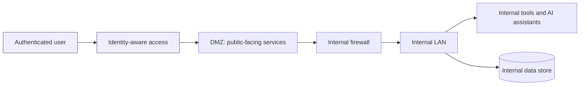
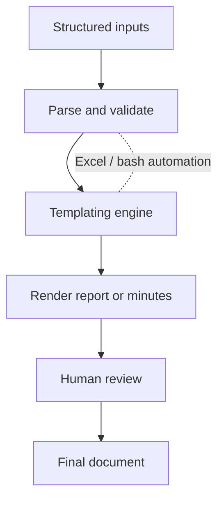

# Engineering at Innpact (professional work, kept private)

This is my day job. I am a Software Engineer at Innpact SA, a regulated impact-finance firm in Luxembourg. The systems, data and business logic here are Innpact's intellectual property and sit inside a regulated environment, so this page stays deliberately at the level of approach and architecture. No proprietary code, configuration, data model or business rule is shown. The point is to describe the kind of engineering I do, not to expose how it is implemented.

A generic, clean-room version of the AI retrieval work I do here is open source as [rag-engine](https://github.com/DeharengOlivier/rag-engine).

## What I build

I work across internal platforms, automation and applied AI, taking systems from idea to production and then driving their adoption inside the teams. The recurring theme is removing manual, error-prone work and making AI usable in a setting where output has to be trusted and auditable.

## Technical work I can describe (at an architecture level)

**Internal platform and intranet.** I built a secure internal web platform that hosts internal tools and AI assistants for the business teams, behind authentication and on isolated infrastructure. It gives non-technical colleagues a single, safe place to reach the tools instead of scattered scripts.

**Automated reporting.** I built pipelines that assemble recurring operational reports from structured inputs, replacing manual copy-and-paste assembly. The work is mostly about parsing, templating and validation, so a report that used to take hours of careful manual handling is produced consistently and on schedule.

**Document automation for board minutes.** I automated the production of recurring governance documents (board minutes) with a mix of Excel automation and bash scripting. Structured inputs are transformed into the required formatted output, which cuts manual effort and the kind of transcription errors that matter for governance records.

**Network architecture.** I designed a segmented network (a separation between a public-facing DMZ and an internal LAN, with identity-aware access) so that internal and client-facing AI tools can be hosted securely, keeping sensitive services isolated from anything exposed.

**Applied AI in production.** I build and deploy LLM-based automation and I led the company-wide rollout of an AI assistant, from adoption strategy through enablement and training. The engineering discipline behind it (retrieval, evaluations, grounding guardrails) is what the open-source [rag-engine](https://github.com/DeharengOlivier/rag-engine) demonstrates in a neutral, non-proprietary form.

## Illustrative architecture patterns (generic, not Innpact's actual topology)

These diagrams show the standard patterns I work with. They are intentionally generic and do not represent any real internal topology.

### Segmented network for hosting internal and client-facing tools

### Reporting and document automation flow

## Why this stays private

The value and the sensitivity both live in the specifics, the data, the rules and the exact implementation, which belong to Innpact and to a regulated context. Keeping this at the level of patterns lets me show the engineering without crossing that line. For the parts I can show in full, see my open-source [projects](https://github.com/DeharengOlivier).
