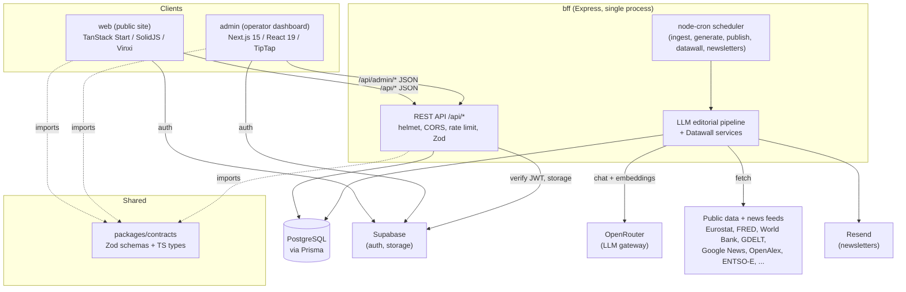
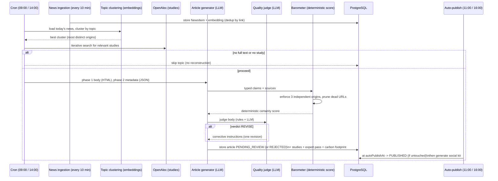
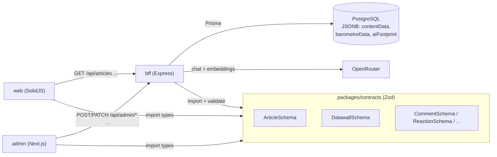
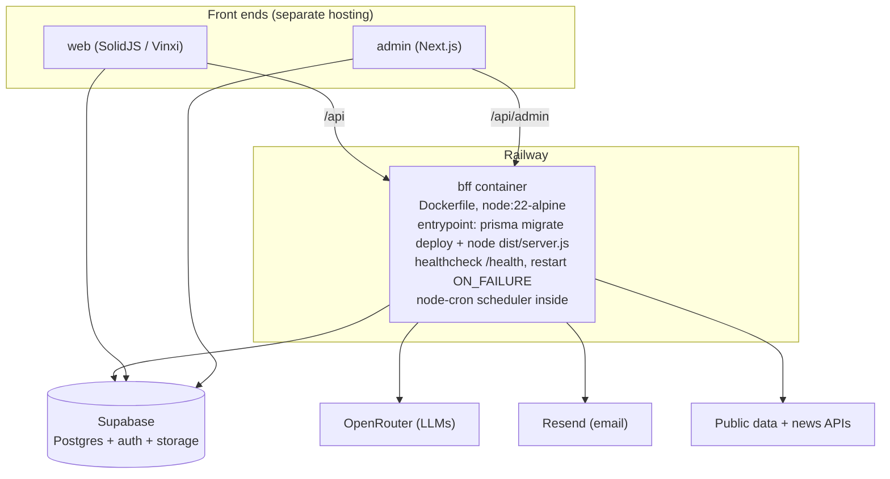

# L'Instant Clair: a French news platform run end to end by AI

Product: https://linstantclair.com

A technical case study read from the actual source code. It maps the real architecture of a TypeScript monorepo whose editorial loop (ingest the news, write the article, score its certainty, publish, syndicate) runs on cron jobs and large language models, with humans acting only as optional reviewers.

## 1. The problem and what it does

A small new media outlet cannot win on ad display (dying CPMs), cannot win the subscription race (winner takes all), and cannot defend "an app that writes articles" (anyone can plug GPT into Google News). The project's own business notes draw that conclusion explicitly and pivot to a defensible signature: a transparent "Barometer of Certitude" that grades, claim by claim, how solid each statement in an article actually is.

Concretely the platform does four things on a schedule, with no human in the loop required:

- It ingests real news every 10 minutes from dozens of public feeds across many categories.
- Twice a day it clusters the day's news by topic, picks the strongest multi-source clusters, pulls real scientific studies that bear on the subject (OpenAlex), and writes a 700 to 1100 word HTML article grounded only in those sources.
- It attaches a structured Barometer of Certitude: a list of typed, sourced claims whose global score is computed deterministically, not by the model.
- It auto-publishes a couple of hours later unless a human operator intervenes through the admin, then keeps a "living barometer" that re-evaluates recent articles each week against fresh news.

Alongside the editorial loop runs a "Datawall": a continuously refreshed wall of public statistical indicators (economy, climate, demographics, energy) with AI-written commentary on whatever moved.

## 2. Monorepo layout and why

Root `package.json` declares npm workspaces: `packages/*`, `bff`, `web`, `admin`, `tests-e2e`. The split is deliberate.

| Workspace | Role | Stack |
| --- | --- | --- |
| `packages/contracts` (`@instant-clair/contracts`) | Single source of truth for API and data shapes. Zod schemas plus inferred TypeScript types, imported by every other workspace. | Zod, TypeScript, Vitest |
| `bff` | The backend for frontend and the entire automation brain: HTTP API, auth, all cron jobs, the LLM editorial pipeline, the news ingestion, the Datawall. | Express, Prisma, PostgreSQL, OpenAI SDK pointed at OpenRouter |
| `web` | The public news site (articles, news feed, debates, Datawall, energy map, methodology). | TanStack Start on SolidJS, Vinxi, Tailwind v4 |
| `admin` | The operator dashboard: a human (or AI operator) validates the queue, edits articles, moderates, manages sources and AI controls. | Next.js 15 App Router, React 19, TipTap |
| `tests-e2e` | Playwright end to end suite. | Playwright |

Why a shared `contracts` package: web (Solid) and admin (React/Next) are different frameworks but must agree exactly with the BFF on what an Article, a Barometer, a Datawall indicator or a Comment looks like. The contracts package carries Zod schemas that are both runtime validators and the compile-time types, so a change to a response shape breaks all three apps at build time, not in production. The BFF build aliases the package to its TypeScript source (`--alias:@instant-clair/contracts=../packages/contracts/src/index.ts`), so there is no separate publish step.

Why the BFF owns everything: this is a backend-for-frontend, not a microservice mesh. A single Express process serves the JSON API, mounts the cron scheduler, runs the LLM pipeline, and holds the in-memory live snapshots (the energy map). One deployable, one database, one place where the "AI-run newsroom" logic lives.

### System architecture

## 3. The BFF in real detail

`bff/src/app.ts` builds an Express app via a `createApp(deps)` factory that takes the Prisma client, an optional Supabase admin client and the auth middlewares as dependencies (so tests can inject mocks and toggle Swagger, rate limiting, sitemap and HTTP logging). It applies `helmet` (a locked Content-Security-Policy in production where only JSON is served), an allowlist CORS based on `WEB_ORIGIN` and `ADMIN_ORIGIN`, `express-rate-limit` tiers (api, auth, admin, strict), `pino-http` logging and a `/health` probe that checks the database, the OpenRouter key and Supabase. Routes are grouped under `/api/*`: public (articles, comments, reactions, debates, datawall, news, search, newsletter, join, organisations, assistant) and admin (`/api/admin/*` guarded by role: ADMIN, EDITOR, AUTHOR). Errors are normalized, and in production raw 5xx messages are hidden.

Authentication is Supabase-issued JWTs. The web app logs in (Google OAuth), and the admin receives the session through an `/auth-handoff` that scrubs the URL hash. The BFF verifies the token and maps the user to a `Role` (VIEWER, AUTHOR, EDITOR, ADMIN) for route guards.

`bff/src/server.ts` is the entrypoint. It refuses to boot without `DATABASE_URL`, `SUPABASE_URL`, `SUPABASE_SERVICE_ROLE_KEY` and `OPENROUTER_API_KEY`, initializes Sentry, instantiates Prisma, builds the app, and unless `ENABLE_CRON_JOBS=false` starts the cron scheduler and warms the energy map from the database.

### The cron schedule (the newsroom clock)

`bff/src/config/cron-jobs.ts` registers the whole editorial day in `Europe/Paris`:

- every 10 min: ingest news for all categories (idempotent, dedup by link)
- every 15 min: refresh live electricity indicators (ODRE) and the European electricity map
- 05:00: refresh Datawall snapshots, then generate AI insights on indicators that changed (world view weekly on Mondays)
- 08:00: generate three draft debates on trending topics
- 09:00 then 14:00: two article generation cycles (afternoon cycle targets a 16:00 publish)
- 11:00 then 16:00: auto-publish whatever the operators did not touch (articles and debates)
- Monday 07:00: weekly "living barometer" revision of recently published AI articles
- 12:00 daily and Sunday 09:00 weekly: newsletters; Mon/Wed/Fri 08:00 followed-rubrics digest
- 03:00: purge old news items

Every job is wrapped in `recordCronRun(...)` which writes a `CronRun` audit row, and failures are reported to Sentry without crashing the loop. The same jobs are exposed as `POST /api/admin/trigger-*` so an operator can run any step on demand.

### The LLM editorial pipeline

The model client (`bff/src/lib/ai-client.ts`) is the OpenAI SDK pointed at OpenRouter's base URL, with a custom `fetch` that intercepts every completion to record `{model, promptTokens, completionTokens}` into an `AiUsage` table (fire and forget, never blocking) and to alert the admin when OpenRouter returns an out-of-credit status. An `AsyncLocalStorage` usage scope lets the pipeline attribute all token cost of one article to that article, which later feeds a carbon-footprint computation. Models are configurable by env, with defaults: a large model for articles, a small model for debates and chat, an embedding model for clustering, and a reasoning model for the exhaustive-hypotheses layer of the barometer.

Generation (`ai-article-scheduling.service.ts` orchestrating `ai-article-generator.service.ts` and `ai-article-quality.service.ts`) is a multi-stage pipeline, not a single prompt:

1. For each category, load the day's ingested `NewsItem`s, drop topics too similar to recent AI articles (a hard dedup window), and cluster the rest by cosine similarity over stored embeddings. Pick the cluster covering the most distinct origins. A cluster with three or more independent origins is treated as multi-source synthesis; otherwise it falls back to the single most recent extractable source.
2. Refuse to write from a title alone. Google News links are non-extractable redirects (roughly two thirds of ingested items), so if no source in the cluster yields full text the topic is skipped rather than reconstructed from the model's memory: a deliberate guard against stale or invented facts.
3. Find relevant scientific studies via an iterative OpenAlex search (derive a query, judge relevance, refine). Science is mandatory: no relevant study, no article.
4. Generate the body in HTML only (phase 1), measured to respect the length far better outside a JSON envelope, with strict editorial rules baked into the prompt: temporal anchoring to today, neutrality and attribution of every institutional claim, descriptive section headings (generic ones are forbidden), no em dashes, no emojis, quotation integrity (a quote is only allowed if it appears verbatim in a provided source).
5. Generate metadata as strict JSON (phase 2) built from the real body: title, summary, and the Barometer claims.
6. Validate and enrich the barometer (below), then run a deterministic-plus-LLM quality judge. If the verdict is "revise", one corrective revision is produced and the better of the two is kept. If quality is still insufficient the article is created in `REJECTED` state (visible in admin, never auto-published).
7. Persist as `PENDING_REVIEW` with a per-article `autoPublishAt` deadline, link the studies, generate an "expert analysis" second pass, compute the carbon footprint from the accumulated tokens and the current grid carbon intensity, and optionally generate a cover image.

The Barometer of Certitude is the editorial signature and the heart of the system. The model never outputs a score. It outputs a list of typed claims (`factuel`, `causal`, `predictif`, `normatif`), each with an epistemic status (`confirme`, `probable`, `hypothese`, `alternative`) and structured sources marked primary or secondary. The code then enforces hard rules: at least three independent origins across the claims (agency wires relayed by many outlets count as one), a re-run of the metadata phase if that floor is not met, dead and homepage-root source URLs pruned before publishing, and a calibration document shared with the weekly revision so generation and revision grade identically. The global score is computed deterministically from this structure in `lib/barometer.utils.ts`. An extra "exploration" layer uses the reasoning model to add a graded fan of hypotheses, fail-safe so it can never block publication.

### Article pipeline (raw story to published article)

### The Datawall

`bff/src/datawall` turns heterogeneous public data APIs into a unified wall of indicators with AI commentary. A declarative registry of indicator definitions (id, title, unit, theme, chart type, provider params) is dispatched to provider adapters that normalize each API's response into a common time-series shape. Confirmed providers in the code include Eurostat, FRED, World Bank, ECB, Our World in Data, FAOSTAT, WHO, UNHCR, UN Population, NOAA, NSIDC, CoinGecko, DBnomics, ODRE (RTE eCO2mix), Statbel, a generic SDMX connector, plus composite and derived providers.

The snapshot service fetches all indicators and writes a new `DatawallSeriesSnapshot` only when a SHA-256 hash of the data changes, with adaptive cadence (annual sources are not refetched daily). The insight service runs only for indicators whose snapshot changed since the last insight, computes a movement score (relative change blended with a z-score against a rolling mean) and a deterministic data digest, then asks a small LLM for a two to four sentence French commentary, storing a trend enum and respecting data-staleness (publication lag) so it never frames old data as current. A world-snapshot service fetches all-country views for choropleths. Separately, an electricity-map service holds a live in-memory snapshot of the European grid (ENTSO-E, with a UK Carbon Intensity fallback), refreshed every 15 minutes.

## 4. Data model and contracts

The data lives in PostgreSQL via Prisma (`bff/prisma/schema.prisma`, around 40 models). The Article model carries the AI provenance fields (`source` HUMAN or AI, `aiModel`, `aiPromptUsed`, `externalSourceUrl`) and several JSONB columns that keep the schema flexible: `contentData` (the HTML), `barometreData` (the scored barometer), `expertData`, `socialKit`, `imageCredit` and `aiFootprint` (tokens, energy, grams of CO2, grid source). State flows through an `ArticleState` enum (`DRAFT`, `PENDING_REVIEW`, `READY_FOR_REVIEW`, `CHANGES_REQUESTED`, `REJECTED`, `PUBLISHED`, `ARCHIVED`, `DELETED`); a `QueueItem` carries the per-article `autoPublishAt` deadline that drives auto-publication. Supporting models include `NewsItem` (with a JSON `embedding`), `DatawallSeriesSnapshot` and `DatawallInsight`, `CronRun`, `AiUsage`, scientific sources, debates, comments, reactions, newsletter subscribers and follows.

The contracts package mirrors these as Zod schemas (article, datawall, debate, comment, reaction, science, newsletter, search, and more) re-exported from one `index.ts`. Because the schemas are both the validators on the wire and the inferred types in the editors, the data contract is enforced at the boundary and at compile time across all three apps.

### Contracts and request flow

## 5. Deployment

The BFF is the only deployed service. `railway.json` pins a Dockerfile build (`bff/Dockerfile`) with the repository root as context, a `/health` healthcheck (120s timeout), an on-failure restart policy, and watch patterns scoped to `bff`, `packages` and the lockfiles. The multi-stage Dockerfile builds on `node:22-alpine`: it copies every workspace manifest so npm can resolve the install plan from the root lockfile, installs only the `bff` workspace and its `@instant-clair/contracts` dependency, generates the Prisma client, bundles the server with esbuild into a single `dist/server.js`, then ships a slim runtime image (with fontconfig and DejaVu fonts so `sharp` can render text in social-card SVGs) running as a non-root user. The entrypoint runs `prisma migrate deploy` then boots the server.

`docker-compose.yml` and `docker-compose.prod.yml` provide local and production-like topologies: the BFF container plus a tmpfs-backed Postgres for tests; the production compose runs migrations then `node dist/server.js`. A `Makefile` wraps the common operations. Persistence (Postgres, auth, file storage) is provided by Supabase, the LLM calls go through OpenRouter, and newsletters go through Resend. The two Next/Solid front ends deploy separately (Vercel artifacts are present) and talk to the BFF over `/api`.

### Deployment topology

## 6. Real tech stack

- Language and tooling: TypeScript across all workspaces, npm workspaces, esbuild (BFF bundle), Vitest unit tests, Playwright e2e.
- BFF: Express 4, Prisma 6 on PostgreSQL, Zod validation, `node-cron`, the OpenAI SDK pointed at OpenRouter, `@supabase/supabase-js`, Sentry, pino logging, helmet, `express-rate-limit`, `sharp` (social images and cover processing), `isomorphic-dompurify` (sanitization), `axios` and `fast-xml-parser` (feeds), `ioredis` and `cache-manager` available for caching, Resend for email.
- LLMs via OpenRouter: a large model for articles (Mistral Large by default), a small model for debates, chat and Datawall insights (GPT-4o-mini by default), `text-embedding-3-small` for clustering, and a reasoning model (DeepSeek R1 by default) for the barometer exploration layer. All overridable by env.
- web: TanStack Start on SolidJS with Vinxi, Tailwind CSS v4 with typography, `@solidjs/meta` for SEO (canonical, OpenGraph, Twitter cards, NewsArticle and Organization JSON-LD), PostHog analytics, Supabase auth client. Server data fetching wraps the BFF with a timeout and graceful fallback so a BFF blip does not 500 a page.
- admin: Next.js 15 App Router with React 19 and Turbopack, Tailwind v4, a TipTap rich-text editor (code blocks, images, links, task lists) with DOMPurify, Supabase auth with role-gated layouts.
- Shared: `@instant-clair/contracts` Zod schemas plus inferred types.
- Public data sources: news (GDELT, Google News RSS, institutional and press RSS, Hacker News, AI lab blogs), science (OpenAlex), and the Datawall providers listed above (Eurostat, FRED, World Bank, ECB, OWID, FAOSTAT, WHO, UNHCR, UN Population, NOAA, NSIDC, CoinGecko, DBnomics, ODRE, Statbel, SDMX, ENTSO-E).

## 7. Engineering decisions and trade-offs

- One BFF process owns the automation. Putting the API, the cron scheduler and the LLM pipeline in a single Express service keeps one deployable, one database and one place to reason about the newsroom. The trade-off is that long LLM jobs share the process with request serving; the code mitigates this with background-triggered jobs, an audited cron table, per-job Sentry capture and a separate Prisma client for the cron context. For a one-operator AI media this simplicity is the right call; horizontal scale of the workers would be a later refactor.

- Determinism around the model, not inside it. The model proposes claims and prose; the system disposes. The barometer score is computed in code, the three-independent-origins rule is enforced (with a re-run), dead and homepage URLs are pruned, quotes are only kept if verbatim in a source, and articles failing quality are stored REJECTED rather than published. This is the difference between "an app that calls GPT" and a defensible product: the trust signal (the barometer) is auditable and reproducible, which the business notes identify as the lesson from Decodex's collapse (a score with no transparent method does not survive).

- Refuse to write from a title alone. Because most Google News links are non-extractable redirects, the pipeline skips topics with no full-text source instead of letting the model reconstruct events from memory. That intentionally lowers volume to protect accuracy, the right trade for a brand whose whole pitch is certainty.

- Shared Zod contracts across three frameworks. Web (Solid), admin (Next) and the BFF disagree on framework but must agree on data; one Zod package gives runtime validation and compile-time types from a single definition, so contract drift breaks the build, not production. The cost is a small coupling: every app depends on the same package version.

- Two front-end frameworks on purpose. The public site uses SolidJS/TanStack Start, the admin uses Next.js with TipTap for a rich editing surface. Different jobs, different tools, joined only by the contracts and the BFF. The reasoning behind the SolidJS choice is detailed in the next section.

- Transparency as a feature, including cost and carbon. Every AI call is metered into `AiUsage`, every article carries its token cost translated into grams of CO2 against the live grid intensity, and the editorial rules (neutrality, attribution, quote integrity, no reconstructed events) are encoded in the prompts and re-checked in code. For a media that is openly AI-run, making the method and the footprint visible is both an ethical stance and the differentiator.

## 8. Why SolidJS for the public site

The public site runs on SolidJS through TanStack Start, and that was a deliberate choice rather than a default. A news platform lives or dies on server-side rendering and SEO, so I wanted fine-grained, precise control over what is rendered on the server and what hydrates on the client. SolidJS is built for exactly that. Its fine-grained reactivity (signals, and no virtual DOM) means hydration happens at the level of individual reactive expressions instead of re-running whole component trees, so the server renders fast and the browser receives very little JavaScript to wake the page up. For content that is essentially static once an article is generated, that yields faster loads and cleaner SEO than a heavier client runtime would.

Speed and efficiency were the other reason. Solid sits at the top of rendering and update benchmarks, and its small runtime is a real edge for a product whose entire promise is being the fast, trustworthy answer.

For most of my other projects I still reach for Next.js. Once you account for the differences in how each framework handles hydration, the feature sets are broadly equivalent, so the deciding factor becomes the ecosystem. Next.js has a far larger community, more libraries, more hiring familiarity and more battle-tested patterns, which makes it the pragmatic default when those matter more than squeezing out the last bit of SSR control. L'Instant Clair is the case where that extra SSR granularity and raw performance were worth choosing the less mainstream tool.
