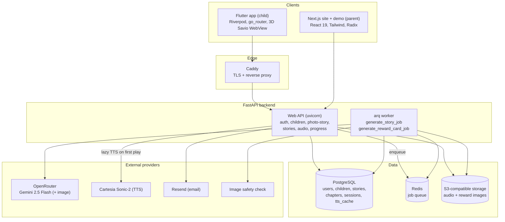
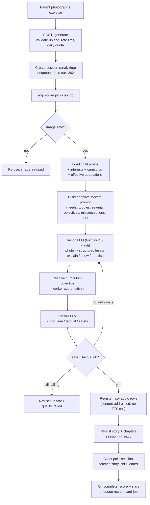
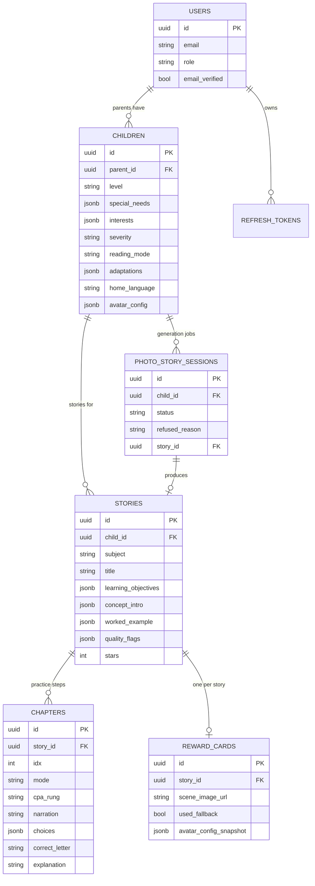

# SaviKids: turning a photographed school exercise into a personalised, accessible AI lesson

Product: https://savikids.com

## 1. The problem and what it does

One-size-fits-all worksheets fail children who learn differently. A child with dyslexia, ADHD or anxiety can know the material yet be blocked by the format (dense text, time pressure, a visible score, abstract notation introduced too early). Re-authoring every lesson by hand for every profile does not scale.

SaviKids closes that gap with a single gesture. A parent photographs the child's actual school exercise. The backend reads the photo, identifies the underlying curriculum objective, and generates a complete, narrated mini-lesson wrapped in a story whose mascot (Savio) is the narrator. The lesson is shaped to the child's profile (special needs, severity, interests, reading mode, home language) and follows an explicit, research-grounded teaching sequence: pre-teach the key term, explain the concept, show a worked example, then practise (guided first, then independent). A reward card with a generated illustration closes the loop, alongside gamification (a dressable 3D Savio, guided breathing).

The codebase targets the Belgian primary system (Federation Wallonie-Bruxelles), levels P1 to P6, four core subjects (francais, maths, sciences, sciences_humaines), and generates in French.

## 2. Architecture in real detail

The system is three repositories: a Python FastAPI backend (the engine and the contract), a Next.js web property (marketing site plus an interactive product demo), and a Flutter native app (the child-facing client). An older Expo/Supabase monorepo prototype also exists but is superseded by the Flutter app and the FastAPI backend.

### Backend (FastAPI + async SQLAlchemy + arq worker)

The API is a thin FastAPI app (`app/main.py`) that wires a body-size-limit middleware, centralised error handlers, and twelve routers (auth, profiles, referentials, adaptations, children, photo-story, quotas, stories, games, avatar, curriculum, progress, audio) plus a `/health` probe. Every data path is async: SQLAlchemy 2.0 with `asyncpg` against PostgreSQL, sessions injected via `Depends(get_session)`.

The defining architectural choice is the split between a fast request path and a slow generation path. Story generation is too slow and too provider-dependent to run inside an HTTP request, so it is offloaded to an **arq** worker over **Redis**:

1. `POST /v1/photo-story:generate` validates the upload (size cap, strict base64, image-format allowlist), enforces a per-user burst rate limit and a per-family daily quota (UTC day), creates a `PhotoStorySession` in status `analyzing`, enqueues `generate_story_job`, and returns `202` immediately.
2. The client polls `GET /v1/photo-story/sessions/{id}` until the session reaches a terminal state (`ready` with a `story_id`, or `refused` with a reason).
3. The worker (`app/worker.py`) runs the full pipeline and writes the finished `Story` and its `Chapter` rows.

The worker is written to never leave a session non-terminal: the job entrypoint wraps the pipeline in a try/except that marks the session `refused` with reason `generation_error` on any unexpected failure, so a polling client always gets a definitive answer. Job timeout is generous (600s) because each generation makes several sequential LLM round-trips; concurrency is 20 jobs per worker process, and throughput scales by running more worker containers against the same Redis queue.

Data model (PostgreSQL, JSONB used heavily for semi-structured AI output, enum-like columns guarded by `CheckConstraint` so a buggy worker cannot persist an out-of-range value):

- `users` (parent or teacher role, bcrypt password hash, email-verified flag, locale, preferences JSONB).
- `children` (the personalisation record: `level`, `special_needs` JSONB, `interests` JSONB, `severity`, `reading_mode`, `adaptations` JSONB of 8 boolean toggles, `home_language` for the L1 bridge, `avatar_config` JSONB). One parent owns many children; ownership is checked on every story/child access.
- `stories` and `chapters` (the generated lesson). The story carries `learning_objectives`, `key_term`/`key_term_intro`, the `concept_intro` (explain phase) and `worked_example` (show phase) JSONB blocks, a snapshot of `reading_mode`, and a server-only `quality_flags` list. Each `chapter` is one practice step with `mode` (guided/independent), `cpa_rung` (Concrete-Pictorial-Abstract), `narration`, an optional `hint`, the MCQ `question` and `choices` JSONB, and server-only `correct_letter`, `explanation`, per-choice `rationale`, and `competency`.
- `photo_story_sessions` (the async job handle: status, refused_reason, story_id).
- `reward_cards` (one per completed story, with a frozen avatar snapshot and a generated or fallback scene image).
- `tts_cache` (content-addressed audio: a hash of the text plus voice/model, and the eventual object-storage URL).
- `refresh_tokens`, `email_verifications`, `game_sessions`.

A clean separation runs through the schema: the child-facing client never receives answers. Correct letters, explanations and per-choice rationales live in server-only columns and are revealed only by `POST /v1/stories/{id}:complete` (and even then, only the rationale of the choice the child actually submitted). The `get_story` endpoint explicitly strips non-exposed keys when projecting choices.

### The AI story-generation and personalisation pipeline

The pipeline is multi-stage and uses an LLM as a structured-output engine, not a free-text generator. The provider layer (`app/ai/provider.py`) wraps `AsyncOpenAI` pointed at **OpenRouter** and decorated with **instructor** in JSON mode (chosen deliberately over tool-calling mode, because the model returns null for deeply nested required arrays under tool mode). Every LLM call returns a validated Pydantic model.

Generation steps inside `generate_story_job`:

1. **Image safety gate.** The submitted photo is checked (`is_image_safe_b64`); an unsafe image refuses the session before any cost is incurred.
2. **Personalisation assembly.** The worker loads the child, resolves interest labels, samples in-level curriculum objectives per core subject, and computes the *effective adaptations* by merging parent toggles with forced protections derived from the child's special needs.
3. **Adaptive prompt construction.** `build_adaptive_prompt` assembles a French system prompt in layers. Two orthogonal dimensions drive it: the 8 boolean adaptation toggles (no time pressure, calm and predictable, simplified language, short chunks, no public score, L1 bridge, CPA maths, motor-friendly UI) emit cross-cutting protective directives, while profile-intrinsic content rules stay keyed on the specific special-need codes. Severity (light/severe) softens or hardens the directives. Structural presets (max words per sentence, max sentences per chapter) are merged by minimum across the child's needs. Further injectors append the curriculum level, the child's interests (used as the story theme, never as a distraction from the concept), the sampled objectives, a misconceptions catalog, and the home-language L1 bridge when the child is allophone.
4. **Vision generation.** `analyze_photo` sends the system prompt plus the photo (as a data URL) to a vision-capable model (`google/gemini-2.5-flash`) and asks for a `PhotoStoryLLM`: a title, the chosen subject, the pre-taught key term, a `concept_intro` (explain), a `worked_example` (show), and the `steps` (practice). The instruction enforces a strict pedagogical order (explain, then show, then practise) and, for maths, the Concrete-Pictorial-Abstract progression with structured visual descriptors the client renders from a vetted asset library (no server-side image generation for lesson visuals).
5. **Objective resolution.** The worker is authoritative on the curriculum objective: it resolves the LLM's `targeted_objective_id` against the real curriculum, falling back deterministically to the first in-level expectation if the hint is unusable.
6. **Verifier pass (a second LLM as judge).** Before serving, `verify_story` runs a separate LLM that returns a `StoryVerdictLLM` judging three guardrails: curriculum alignment (G1), factual correctness including whether the MCQ answer marked correct is actually correct (G2), and age-safety (G5). A failed safe or factual verdict triggers one regeneration; if it still fails, the session is refused (`content_unsafe` or `quality_failed`) and nothing is persisted. Curriculum drift is treated as less harmful: the story is still served but the issues are recorded in server-only `quality_flags` for monitoring. A readability check flags narrations whose sentences overshoot the child's merged target.
7. **Lazy audio registration.** Generation never calls the TTS provider. For each piece of text it upserts a content-addressed `tts_cache` row and points the audio URL at this API's `/v1/audio/{hash}.mp3` endpoint. Audio is synthesized on first play by **Cartesia** (Sonic-2) and cached forever in object storage. This decouples generation from TTS (a TTS outage cannot fail a generation) and collapses platform-wide synthesis to unique phrases.
8. **Persistence.** The story, concept intro, worked example and chapters are written, the session flips to `ready`.

A separate `generate_reward_card_job` runs on story completion: a two-stage image pipeline extracts a structured scene from the story ending (stage 1, text LLM) then generates an illustration with the Savio reference PNG as a conditioning image (stage 2, `google/gemini-2.5-flash-image`), moderates the result, uploads it to S3, and always falls back to a pre-vetted scene image plus a caption and a lazy vocal congratulation, so the child is never left without a reward.

### Web client (Next.js)

`savikids-web` is the public web property: Next.js 16 with React 19, Tailwind CSS v4, the Radix UI / shadcn component set, `next-intl` for localisation, TanStack Query, React Hook Form with Zod, and Framer Motion. It hosts the marketing pages, a beta-signup flow, and an interactive product demo (`/demo`) built from a phone-mock component tree (screens, overlays, flows) that simulates the app experience in the browser, plus a `send-email` API route (Resend / Nodemailer). It is the storefront and demo, not the production data client.

### Mobile app (Flutter)

`savikids-native-app` is the child-facing client: Flutter (Dart SDK 3.12), Riverpod for state, go_router for navigation, google_fonts, and flutter_inappwebview. The UX is a three-page, Snapchat-style core inside a `HomeShell` PageView (camera, Savio, history), with deep pushed routes for onboarding, the generating screen, the lesson, guided breathing, the dressing room, and a swipe-up parent gate and parent zone. The signature feature is a shared 3D Savio mascot mounted once above every route (preloaded, instant): a custom WebView viewer driving a GLB model (semantic material per body part, idle-breath and wave animations) via a JS bridge, reused for the avatar dressing room and the breathing exercise scene.

Architecturally the app is built behind repository interfaces (`LessonRepository`, `HistoryRepository`, `GamesRepository`) that are the only data doorway the UI knows. The current build binds Fake implementations (so the full UX can be validated end to end), with the design intent that a generated Dart client (from the backend OpenAPI contract, present under `clients/dart` and `openapi/`) swaps in without the UI changing.

### Auth

Email/password auth in `app/core/security.py`: bcrypt password hashing, short-lived HS256 JWT access tokens (15 min) carrying `sub` and `role`, and opaque refresh tokens stored only as SHA-256 hashes with a 30-day TTL and rotation. Signup is `202` with an email-verification step (Resend). Production config fails fast at boot if the JWT secret is still the placeholder or too short for HS256, or if any provider/storage credential is still a test placeholder, or if the public API base URL is not a real https origin.

### Deployment (docker-compose)

The same Docker image (multi-stage, `python:3.12-slim` pinned by digest, `uv` for dependency install, run as a non-root user, with a `/health` HEALTHCHECK) runs three roles: web (uvicorn), worker (arq), and a one-shot migrate step (`alembic upgrade head`) kept out of the web boot so replicas never race on migrations.

- **Local dev** (`docker-compose.yml`): Postgres 16, Redis 7, MinIO as the S3-compatible store (with a one-shot bucket-creation container), the migrate step, the app, and the worker.
- **Production** (`docker-compose.prod.yml`) on a single VM: Caddy terminates TLS (automatic Let's Encrypt) and reverse-proxies to the web container, forwarding the real client IP for rate limiting; db and redis are internal-only (not published to the host); secrets come from a `deploy/prod.env` file. Object storage is a Hetzner S3-compatible endpoint.

## Diagrams

### System architecture (backend + web + mobile)

### Story-generation pipeline (photographed exercise to personalised lesson)

### Data model (core entities)

## 5. The real tech stack

**Backend**: Python 3.12, FastAPI, Uvicorn, SQLAlchemy 2.0 (async) + asyncpg, PostgreSQL 16, Alembic migrations, Pydantic v2 / pydantic-settings, arq + Redis (job queue and worker), bcrypt + PyJWT (auth), httpx, boto3 (S3-compatible storage), google-cloud-vision. LLM access through the OpenAI SDK pointed at OpenRouter with instructor for structured Pydantic output; models used are `google/gemini-2.5-flash` (vision generation, scene extraction, verifier) and `google/gemini-2.5-flash-image` (reward illustration). TTS via Cartesia (Sonic-2). Email via Resend. Tests with pytest, pytest-asyncio and schemathesis against the OpenAPI contract.

**Web**: Next.js 16, React 19, TypeScript, Tailwind CSS v4, Radix UI / shadcn, next-intl, TanStack Query, React Hook Form + Zod, Framer Motion, Resend/Nodemailer, Vitest.

**Mobile**: Flutter (Dart 3.12), Riverpod, go_router, google_fonts, flutter_inappwebview (3D Savio via a bundled model-viewer GLB engine).

**Infra**: Docker multi-stage build, docker-compose (dev and prod), Caddy (TLS + reverse proxy), Hetzner S3-compatible object storage, MinIO in dev.

## 6. Engineering decisions and trade-offs

- **Async job queue over synchronous generation.** Generation makes several sequential LLM round-trips and can take many seconds; doing it in-request would tie up workers and time out clients. The `202` + poll pattern, with the worker guaranteed to drive every session to a terminal state, keeps the API responsive and the UX honest. Trade-off: the client must poll and handle a `refused` outcome. Why it matters: a neurodivergent child waiting on a frozen screen is a worse failure than an explicit, retryable refusal.

- **LLM as a structured, validated engine, not a chatbot.** Every LLM call returns a Pydantic model via instructor in JSON mode. This makes the AI output a typed contract the rest of the system can trust, and the JSON-mode choice is a measured response to Gemini's nested-schema behaviour under tool-calling. Trade-off: more schema engineering up front.

- **A second LLM as a safety and quality judge.** Serving factually wrong or frightening content to vulnerable children is the cardinal risk, so generation is gated by a verifier pass with explicit curriculum, factual and safety verdicts, one regeneration on failure, and a hard refusal otherwise. Curriculum drift is downgraded to a monitored flag rather than a block, balancing safety against availability. Why it matters: the product's trust with anxious children and their parents depends on never shipping a wrong answer marked correct.

- **Lazy, content-addressed audio.** Generation never blocks on TTS; audio is registered as a hash and synthesized on first play, cached forever. This decouples the slow generation path from the speech provider (a TTS outage cannot fail a lesson) and collapses synthesis cost to unique phrases across the whole platform. Why it matters: full-oral and hybrid reading modes are core accessibility features for dyslexic and pre-reading children, so audio must be cheap and reliable.

- **Pedagogy encoded as structure, not just prose.** The explain-show-practise order, the gradual-release guided-to-independent steps, the Concrete-Pictorial-Abstract maths rungs, and the per-choice diagnostic rationales are first-class fields in the schema and enforced by the prompt. The personalisation is layered (8 boolean toggles for cross-cutting adaptations, special-need codes for content rules, severity as an intensity modifier, an L1 bridge for allophone children). Why it matters: this is what makes the same objective genuinely reachable for a child with dyslexia, ADHD or anxiety, and it is the defensible core of the product.

- **Answers never leave the server.** Correct letters, explanations and full rationales are server-only and revealed only on completion (and only for the submitted choice). The database enforces enum domains with check constraints so a buggy worker cannot corrupt a child's record. Why it matters: integrity of the learning loop and resistance to client tampering.

- **Single-image, single-VM operability.** One Docker image runs web, worker and migrations; production is a self-contained docker-compose on a VM with Caddy for TLS and internal-only data services. This keeps an early-stage product cheap and easy to operate while leaving clear scale-out seams (more worker containers on queue depth, PgBouncer noted for connection scaling). Trade-off: not yet a managed/multi-region setup, which is a deliberate stage-appropriate choice.
